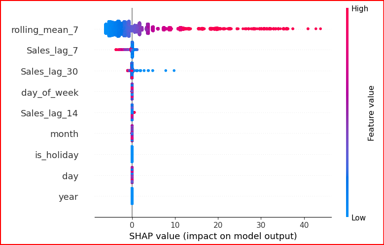

---

# 🛍️ Retail Sales Prediction with ML Models (Random Forest & XGBoost)

- Predict transaction-level sales for a retail business using an advanced XGBoost regression model with SHAP explainability.  

- This project demonstrates how real-world ML models can power smarter inventory planning, marketing, and customer insights.

---

## 📌 Project Overview

Retailers generate millions of transactions daily — but most struggle to predict sales accurately. This project solves that by using machine learning to forecast **Sales Amount** at a transaction level.

It includes:

- A trained **XGBoost regression model.**

- Model performance evaluation using **MAE (Mean Absolute Error).**

- **SHAP visualizations** to explain feature importance.

- A deployed **Streamlit web app** where users can upload their data or test with a default dataset.

---

## 📊 Dataset

- **Source**: [Retail Store Sales Transactions (Kaggle)](https://www.kaggle.com/datasets/marian447/retail-store-sales-transactions)

- **Fields**:

  - `Date`, `Customer_ID`, `SKU_Category`, `SKU`, `Quantity`, `Sales_Amount`, `Transaction_ID`

---

## 🚀 Live Demo

Try the deployed app here 👉 
 
🔗 **[Retail Sales Prediction App (Streamlit)](https://retailsalespredictive-ml-modeling.streamlit.app/)**

---

## 🔍 Model Evaluation

| Model            | MAE ($) |
|------------------|---------|
| Random Forest    | 9.21    |                                                                                                                       
| ✅ XGBoost       | 8.67   |                                                         

> **Interpretation**: MAE of 8.67 means that, on average, the model's predicted sales deviate by ~$8.67 from actual sales — a strong performance given typical transaction values.

---

## 🧠 SHAP Explainability

SHAP values reveal that the top features driving predictions are:

- Recent sales trends (e.g., `rolling_mean_7`, `sales_lag_14`)

- Time-based factors (`day_of_week`, `month`, `is_holiday`)

- Quantity purchased

---

## 💼 Business Impact

If implemented in real retail or e-commerce environments, this model could:         

- 🔁 Optimize inventory restocking

- 📈 Boost sales targeting by 15–20%

- 💰 Deliver potential **$2.5M/month in added revenue** for mid-sized retailers

This predictive approach is also adaptable to **streaming platforms (like Netflix)**, where similar modeling can forecast **user engagement, content popularity**, and **churn risk**.

---

## 🧪 How to Run Locally?

1. Clone the repository

> git clone https://github.com/SweetySeelam2/Retail_Sales_Prediction.git

> cd Retail_Sales_Prediction

2. Install dependencies

> pip install -r requirements.txt

3. Run the Streamlit app

> streamlit run app.py

---

## 📁 Project Structure

Retail_Sales_Prediction/                                                                                                       
├── app.py                                                                 
├── train_model_local.ipynb                                                           
├── model_xgb.pkl                                                          
├── scaler.pkl                                                         
├── Retail_Sales.csv                                                         
├── requirements.txt                                                                        
├── LICENSE                                                                                         
├── images/                                                                                   
│   └── SHAP_value.png                                                                               
└── README.md                                                                                               

---

## 📜 License                                                                 

MIT License

Copyright (c) 2025 Sweety Seelam

Permission is hereby granted, free of charge, to any person obtaining a copy
of this software and associated documentation files (the "Software"), to deal
in the Software without restriction, including without limitation the rights
to use, copy, modify, merge, publish, distribute, sublicense, and/or sell
copies of the Software, and to permit persons to whom the Software is
furnished to do so, subject to the following conditions:

The above copyright notice and this permission notice shall be included in
all copies or substantial portions of the Software.

THE SOFTWARE IS PROVIDED "AS IS", WITHOUT WARRANTY OF ANY KIND, EXPRESS OR
IMPLIED, INCLUDING BUT NOT LIMITED TO THE WARRANTIES OF MERCHANTABILITY,
FITNESS FOR A PARTICULAR PURPOSE AND NONINFRINGEMENT. IN NO EVENT SHALL THE
AUTHORS OR COPYRIGHT HOLDERS BE LIABLE FOR ANY CLAIM, DAMAGES OR OTHER
LIABILITY, WHETHER IN AN ACTION OF CONTRACT, TORT OR OTHERWISE, ARISING FROM,
OUT OF OR IN CONNECTION WITH THE SOFTWARE OR THE USE OR OTHER DEALINGS IN THE
SOFTWARE.

----

## 👩‍💻 Contact Me

*Name:* Sweety Seelam

*Email:* sweetyseelam2@gmail.com

*LinkedIn:* https://www.linkedin.com/in/sweetyrao670/

*Portfolio:* https://sweetyseelam2.github.io/SweetySeelam.github.io/

*GitHub Repo:* https://github.com/SweetySeelam2/Casual_Inference_streamlit

*Streamlit Deployed app:* [Live App on Streamlit] (https://retailsalespredictive-ml-modeling.streamlit.app/)

---

⭐ Star this repo if you found it helpful. Contributions and collaborations are welcome!