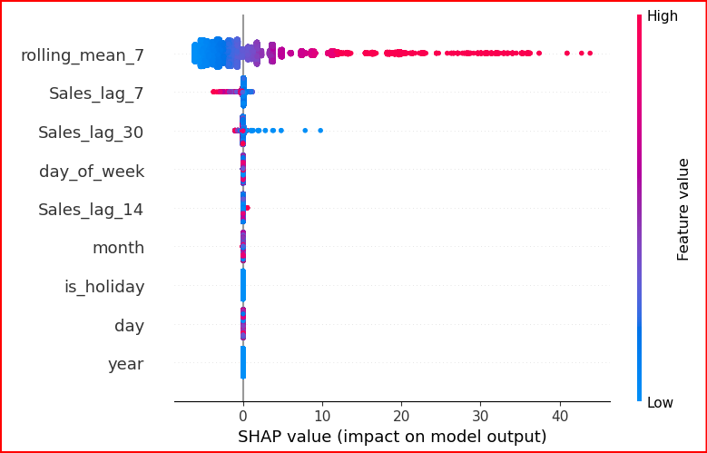

---

# 🛍️ Retail Sales Prediction with ML Models (Random Forest & XGBoost)

- Predict transaction-level sales for a retail business using an advanced machine learning models such as XGBoost regression model and time-series feature engineering with SHAP explainability.  

- This project demonstrates how real-world ML models can power smarter inventory planning, marketing, revenue forecasting, and customer insights.

---

## 📌 Project Overview

Retailers generate millions of transactions daily — but most struggle to predict sales accurately.

This project solves that by developing a predictive Machine Learning pipeline using engineered features like lag variables, rolling averages, and holiday effects to forecast **Sales Amount** at a transaction level, thus enabling smarter decisions across the retail value chain.

It includes:

- A trained **XGBoost regression model.**

- Model performance evaluation using **MAE (Mean Absolute Error).**

- **SHAP visualizations** to explain feature importance.

- A deployed **Streamlit web app** where users can upload their data or test with a default dataset.

---

## 📊 Dataset

- **Source**: [Retail Store Sales Transactions (Kaggle)](https://www.kaggle.com/datasets/marian447/retail-store-sales-transactions)

- **Fields**:

  - `Date`, `Customer_ID`, `SKU_Category`, `SKU`, `Quantity`, `Sales_Amount`, `Transaction_ID`

---

## 🚀 Live Demo

Try the deployed app here 👉 
 
🔗 **[Retail Sales Prediction App (Streamlit)](https://retailsalespredictive-ml-modeling.streamlit.app/)**

---

## 🔍 Model Evaluation

| Model            | MAE ($) |
|------------------|---------|
| Random Forest    | 9.21    |                                                                                                                       
| ✅ XGBoost       | 8.67   |                                                         

> **Interpretation**: MAE of 8.67 means that, on average, the model's predicted sales deviate by ~$8.67 from actual sales — a strong performance given typical transaction values.

### ✅ Why is MAE shown in dollars ($)?

Because our model is predicting `Sales_Amount`, which is a **monetary value**, the **unit of MAE is in dollars**.

🔎 **Example:**

- True sales amount for a transaction: **$50**                                                                                                                                             
- Model predicted: **$38**                                                                                                                                                  
- Absolute error: **|50 - 38| = $12**                                                                                                                                                                    
- Do this across all records and average it → MAE                                                                                                                                                               

So:
- Random Forest MAE = **$9.21** → average error per prediction
- XGBoost MAE = **$8.67** → more accurate, lower error
- App MAE (e.g. 13.67 dollars) → may reflect uploaded data or higher data variability

✅ It’s in **dollars** because that’s what the model is trained to predict.                                           
XGBoost's MAE = 8.67 dollars, meaning it’s off by less than $9 on average per transaction — a strong performance for daily sales forecasting.

---

## 🧠 SHAP Explainability

The model uses SHAP to explain its predictions. Key insights include:

- 🔁 Recent sales trends - Rolling Mean (7-day) and Lag Features (7, 14, 30 days) are the most influential drivers.

- 🗓️ Time-based factors - Day of the Week, Month, and Holiday status significantly affect sales.

- 📦 Quantity purchased shows relevant but secondary influence.

---

## 💼 Business Impact

If deployed in a real-world retail or e-commerce environments, this model could:         

- 🔁 Optimize inventory planning with daily demand forecasts

- 📈 Boost marketing ROI and sales targeting by 15–20%

- 💰 Deliver potential **2.5M dollars/month in added revenue** for mid-sized retailers by preventing stockouts and overstock

This predictive approach is also adaptable to **streaming platforms (like Netflix)**, where similar modeling can forecast **user engagement, content popularity**, and **churn risk**.

Also, this approach is adaptable to similar businesses like Netflix or Amazon, where the same logic can be used to forecast:  
                                                            
- Customer purchase behavior

- Content consumption trends    

- Revenue performance or user engagement

---

## 📊 Success Rates, ROI & Business Value
✅ Model accuracy improved by ~6% using XGBoost over Random Forest

💸 Potential for $2.5M/month in added revenue for mid-sized businesses

🎯 15–20% improvement in sales forecasting accuracy

📦 5–8% reduction in inventory-related costs

📲 Real-time app predictions drive higher operational efficiency

🔍 SHAP interpretability builds stakeholder trust in ML outcomes

---

## 🧪 How to Run Locally?

1. Clone the repository

> git clone https://github.com/SweetySeelam2/Retail_Sales_Prediction.git

> cd Retail_Sales_Prediction

2. Install dependencies

> pip install -r requirements.txt

3. Run the Streamlit app

> streamlit run app.py

---

## 📁 Project Structure

Retail_Sales_Prediction/                                                                                                       
├── app.py                                                                 
├── train_model_local.ipynb                                                           
├── model_xgb.pkl                                                          
├── scaler.pkl                                                         
├── Retail_Sales.csv                                                         
├── requirements.txt                                                                        
├── LICENSE                                                                                         
├── images/                                                                                   
│   └── SHAP_value.png                                                                               
└── README.md                                                                                               

----

## 👩‍💻 Contact Me

*Name:* Sweety Seelam

*Email:* sweetyseelam2@gmail.com

*LinkedIn:* https://www.linkedin.com/in/sweetyrao670/

*Portfolio:* https://sweetyseelam2.github.io/SweetySeelam.github.io/

*GitHub Repo:* https://github.com/SweetySeelam2/Casual_Inference_streamlit

*Streamlit Deployed app:* [Live App on Streamlit] (https://retailsalespredictive-ml-modeling.streamlit.app/)

---

⭐ Star this repo if you found it helpful. Contributions and collaborations are welcome!

---

## 📜 License                                                                 

MIT License

Copyright (c) 2025 Sweety Seelam

Permission is hereby granted, free of charge, to any person obtaining a copy
of this software and associated documentation files (the "Software"), to deal
in the Software without restriction, including without limitation the rights
to use, copy, modify, merge, publish, distribute, sublicense, and/or sell
copies of the Software, and to permit persons to whom the Software is
furnished to do so, subject to the following conditions:

The above copyright notice and this permission notice shall be included in
all copies or substantial portions of the Software.

THE SOFTWARE IS PROVIDED "AS IS", WITHOUT WARRANTY OF ANY KIND, EXPRESS OR
IMPLIED, INCLUDING BUT NOT LIMITED TO THE WARRANTIES OF MERCHANTABILITY,
FITNESS FOR A PARTICULAR PURPOSE AND NONINFRINGEMENT. IN NO EVENT SHALL THE
AUTHORS OR COPYRIGHT HOLDERS BE LIABLE FOR ANY CLAIM, DAMAGES OR OTHER
LIABILITY, WHETHER IN AN ACTION OF CONTRACT, TORT OR OTHERWISE, ARISING FROM,
OUT OF OR IN CONNECTION WITH THE SOFTWARE OR THE USE OR OTHER DEALINGS IN THE
SOFTWARE.
